

# Bitwise Bandits — Ace Hardware Multi-Store Website Redesign

## Overview
Bitwise Bandits is redesigning and modernizing the multi-store website for Ace Hardware locations owned by our client, Greg Werner. Their <a href="https://granitebayace.com/"> current Ace Hardware website <a/> is outdated, difficult to maintain, visually inconsistent, and extremely expensive to host. Our mission is to deliver a modern, fast, clean, and cost-efficient website that provides accurate store information while reducing long-term hosting burden.

## Project Synopsis
This project rebuilds Ace Hardware’s multi-location website from scratch using modern web practices. We aim to:
- Replace the expensive legacy hosting with a low-cost (sub–$150/yr) solution
- Create modular store components
- Build a visually consistent, professional front end
- Support easy expansion as store count increases

### How we Rebuilt the Website
- Identified outdated layout patterns, inconsistent styling, and navigation gaps, such as only Facebook is the official social media account, and customers have to click on a link to see a PDF file for Specials
- Mapped all existing pages, images, and content while talking to the client via Zoom to understand what they needed preserved
- Reviewed the performance issues and hosting limitations of the legacy site
- Designed a prototype using Figma and showed it to the client for approval.

### 🖥️ Front End Solution
- Reorganized all existing content into separate, clearly defined pages to improve navigation and readability.​
- Implemented a responsive navigation bar for consistent access to pages across all screen sizes.​
- Added dropdown menus to display detailed information in a clean, compact format.​
- Redesigned headers and footers to create a modern, cohesive look throughout the site.​
- Added designated spaces for advertisements on the homepage, allowing them to be easily added, edited, or updated as needed.​
- Enhanced the overall user interface and visual hierarchy, aligning the website with modern web design standards and improving accessibility.

### 🛠️ Back End Solution
- Allow existing admins to control user roles and permissions more efficiently​
- Allow admins to manage advertisements​
- Storing admin-related info in a database
- Implemented Google Maps API for intuitive user interaction

## Current Website:

### We decided to divide the original site into multiple different pages to make information easier to digest.

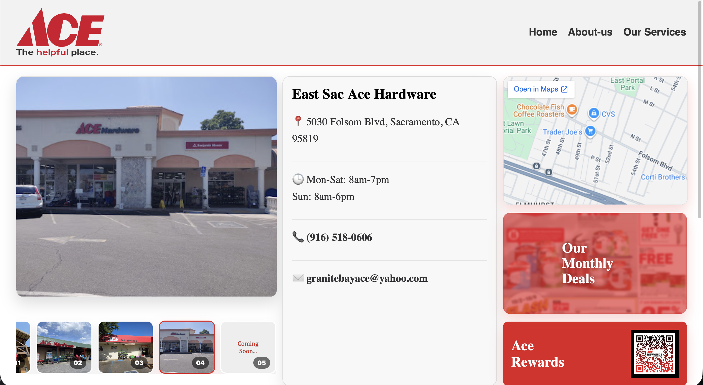
<strong> Home Page:</strong> The home page has been reworked to now display each stores' information on rotation. It also the place to view monthly deals and join the Ace Hardware rewards program.
   

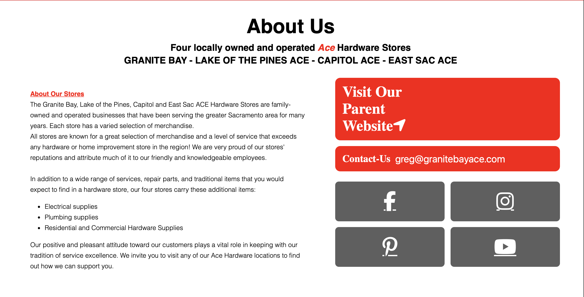
<strong> About Page: </strong> The about page contains basic information on the left and links to extra resources on the right.
   

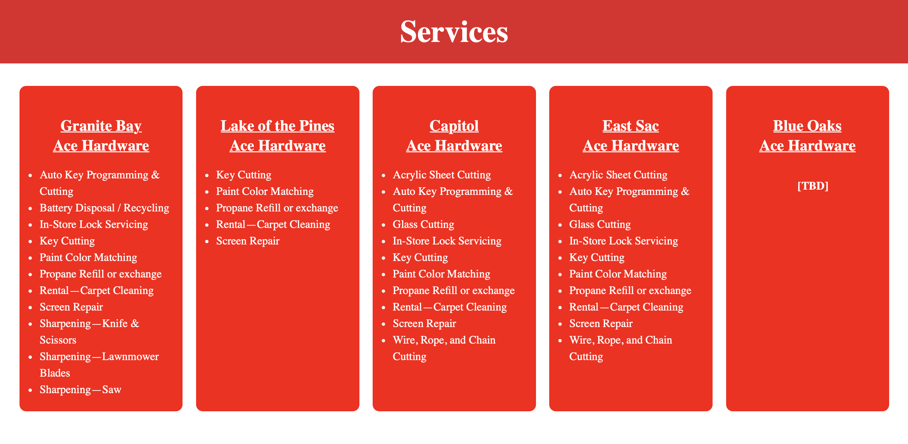
<strong> Services Page: </strong> The services was specially requested so users can view which stores offer which services.
   

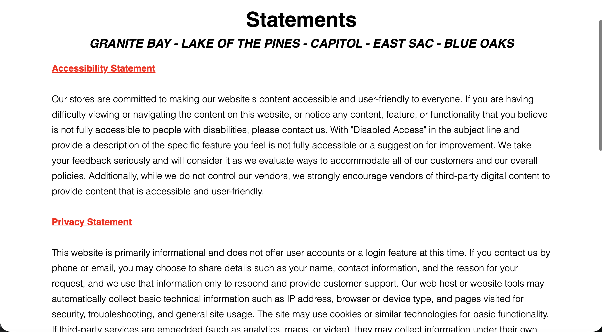
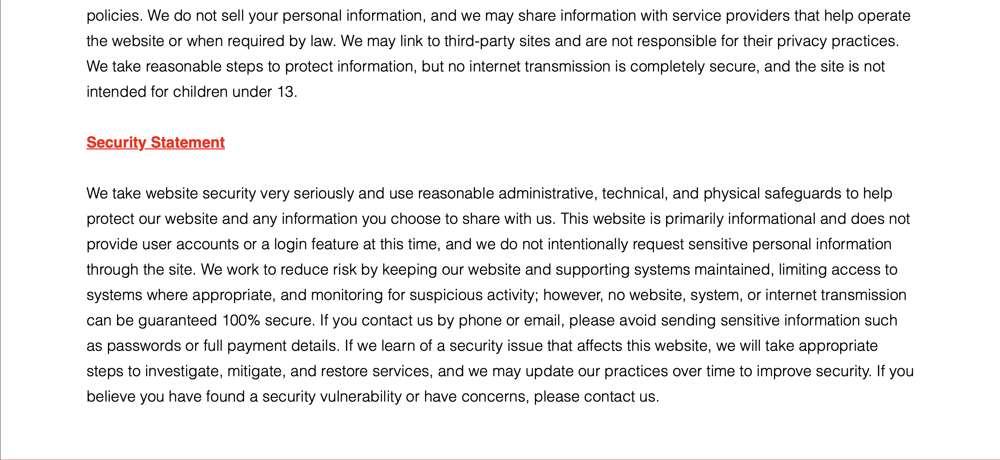
<strong> Statements Page: </strong> All the statements are now integrated into a singular page to make their respective information easier to access.
   

<strong> Login Page: </strong> A basic login page for both admin and managers.
   

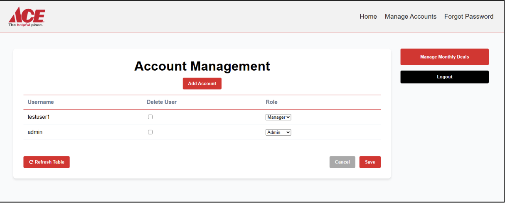
<strong> Manager Account Page: </strong> The landing page for the admin/manager upon successful login. It is design to contain all major functionalities in one place.
   

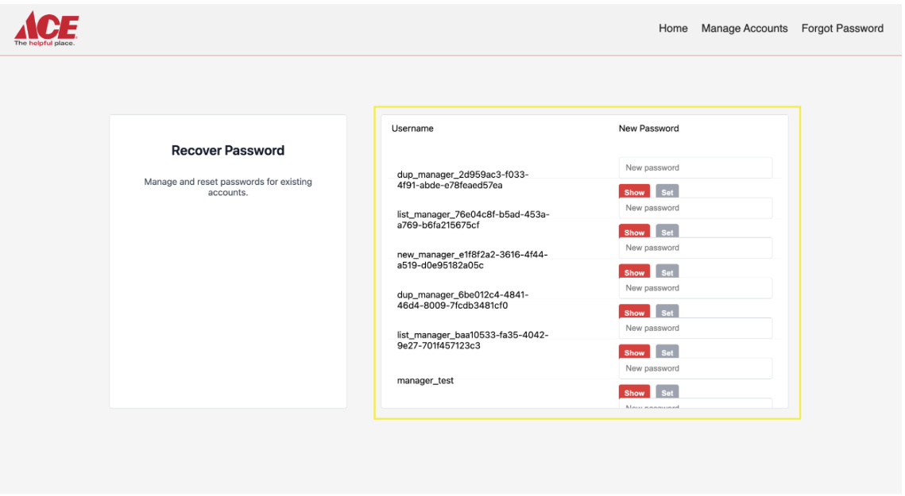
<strong> Recover Account Page: </strong> Accessible to both admins and managers but only interactable by admins, this is a dedicated page to reset account password.
 

## Tech Stack
     
- IDE 
  - IntelliJ 
- Frontend​
  - HTML, CSS, JavaScript​
- Framework
  - Java
- Backend​
  - SQLite ​
- API’s ​
  - N/A​
- Version Control​
  - Git/Github​
- Testing Framework
  - JUnit5
- Servers​/Server Cost
  - Estimated cost for Amazon Lightsail:​
  - Domain cost: $10-20/year​
  - Backend/DB cost: $0.0047/hour ($3.50/mo)​
  - Framework hosting: Amazon Lightsail deployed with Docker Images
 
## Prototype With Figma

## Application Flow

## Developer Setup
The following needs to be installed on a computer to properly start development work on the website.

<strong> Java <strong>
1. Any runtime environment following the Oracle Java 21 specifications needs to be installed and referenced in the PATH/JAVA_HOME environment variables of the system.
2. Installation of Java 21 can be validated by executing ‘java —version’ in the command-line.
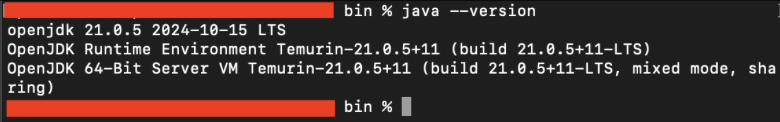
  

<strong> Git <strong>
1. GitHub Desktop, git cli, or any way of cloning, committing, pushing, etc. needs to be installed on the system for development.
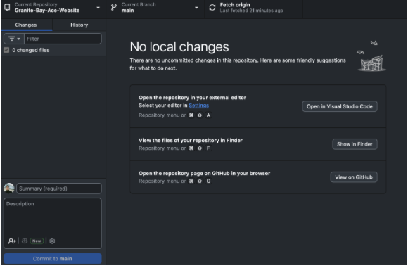
  

<strong> IDE <strong>
1. Any Java IDE which supports Gradle 7.3.3 with Kotlin for the DSL 1.5.31 can be used for development (Eclipse, IntelliJ, VSCode, etc.).
 

## Testing
Running all automated test:

1. Open a terminal window in your respective IDE.
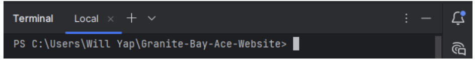
  
2. Run ‘./gradlew test’ in the terminal.
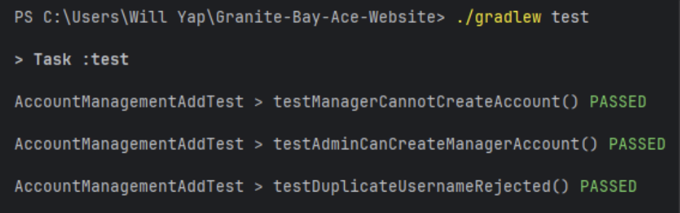
  

Running a certain automated test:

1. Open a terminal window in your respective IDE.

  
2. Run ‘./gradlew  test <Test Name>’ in the terminal.
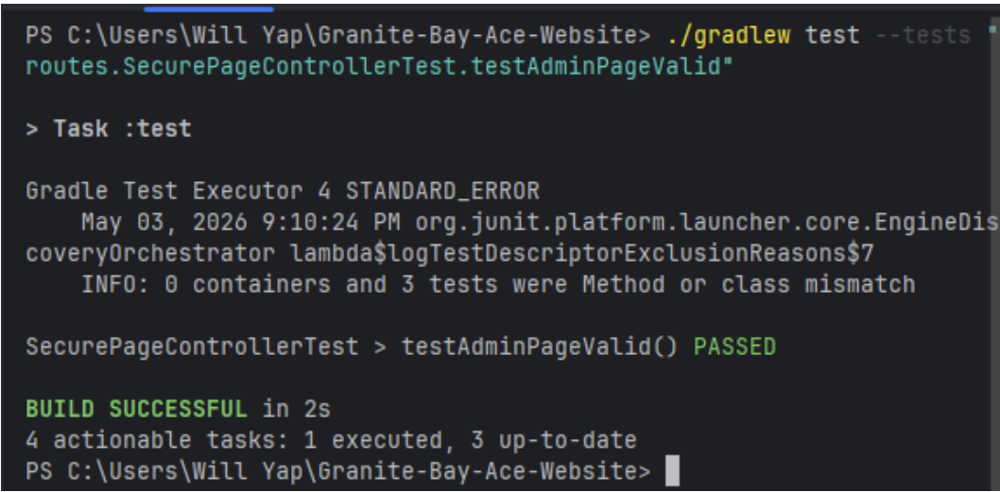
  
3. To look at the different integration and unit tests please navigate to src/test/routes or src/test/unit. 
 

## Deployment
Since the client intends to self-host, the final production deployment of the website is handled by the client’s IT team. Once deployed by the IT team, the website should be accessible through a live public URL with interactive pages for customers along with functioning admin operations.
  
To demonstrate deployment, we will instead show the hosting strategy that we will use for our senior project showcase. This involves hosting the application in a controlled environment using the following steps.

<Strong> Preparation for Deployment <Strong>
Ensure all traffic is secure and aligns with standard secure web practices.
- Update the server mode from HTTP to HTTPS
- Change the port from 80 to 443
 

<Strong> Build the Application Distribution <strong>
Generate a packaged version of the product that can be deployed on another device.
- In the preferred IDE (we are using IntelliJ), navigate to the designated project folder, replacing <path/to/project> with your project path.
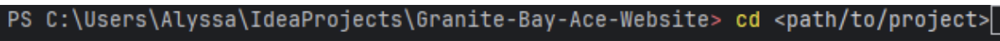

 
- Run the following command: ./gradlew distZip
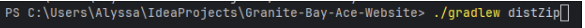
  

<strong> Transfer and Extract the Build <strong>
Prepare the application files on the device where it will be hosted.
- In your project directory, navigate to build/distributions to find the generated ZIP file in your file explorer located at the following location.
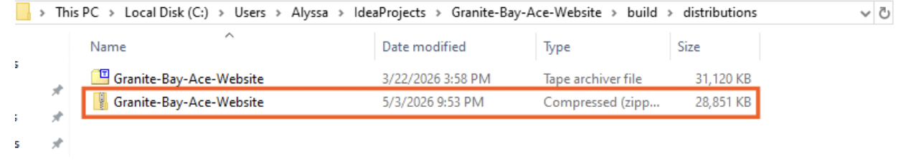
  

<strong> Configure Security Certificates <strong>
Enable HTTPS by allowing the server to encrypt incoming and outgoing traffic.
- Place the TLS certificate into the same directory/folder as the application files
 

<strong> Start the Application <strong>
Initialize the application and begin serving requests.
- From the contents in the extracted ZIP file, navigate to Granite-Bay-Ace-Website/bin
- Execute the start script to launch the server
 

<strong> Configure Network Access <strong>
Allow external users to access the hosted application securely.
- Open port 443 on the device’s firewall
- Ensure the network allows for inbound connections

<strong> Configure Domain Routing <strong>
Allow users to access the application using a domain instead of an IP address.
- Change domain names to point at the public IP address of the device
 

## Team
 

* Matthew Farr (Lead)
* Spencer Nold
* Daniel Balolong
* Alyssa Jimenez
* Arsal Mahmood
* Timothy Talampas
* William Yap
* Nguyen Ho

Client: Greg Werner
